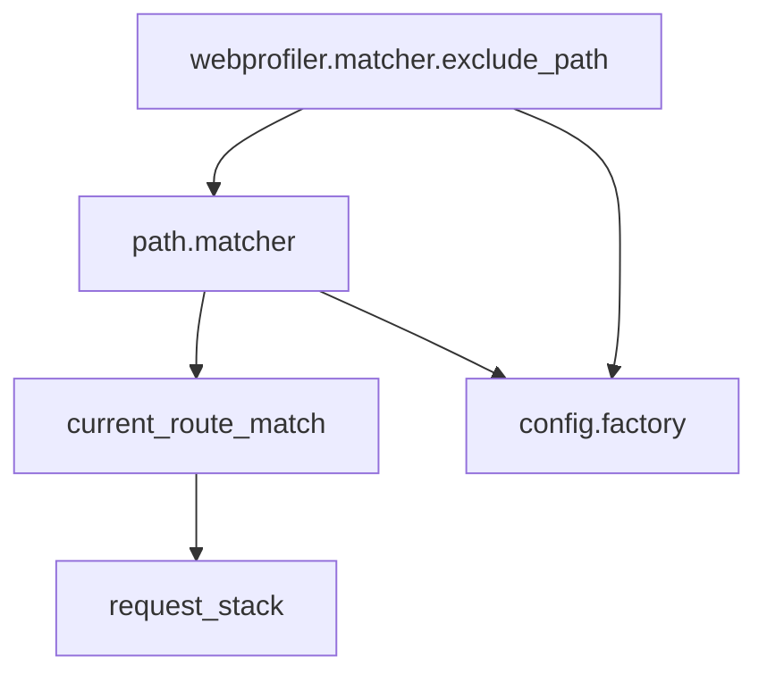
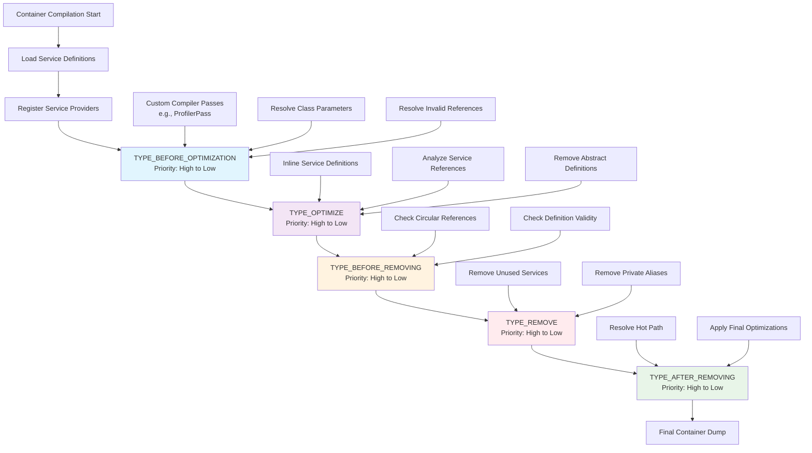

# Drupal service container deep dive part 1: tags, compiler passes, service providers and autoconfiguration

The evolution of Drupal core has increasingly embraced modern PHP standards and robust object-oriented programming (OOP) principles, driven largely by its integration of **Symfony components**. Central to this modernization is the **Service Container**, which acts as the core registry responsible for service instantiation, dependency resolution, and lifecycle management.

A **service** is inherently a specialized, reusable, and stateless object designed to perform a single, well-defined task, such as ConfigFactory for configuration access or EntityTypeManager for entity access.  

The philosophy underpinning service usage is the promotion of loose coupling and adherence to the Dependency Inversion Principle (DIP). A class using a service should request it from the container rather than manually instantiating it with the `new` keyword. This arrangement enables developers to swap implementations without altering consuming code.  

In this series of articles, we will explore the Drupal service container in depth, focusing on its features, capabilities, and best practices for leveraging it effectively in Drupal module development.

* **Part 1** will cover service tags, compiler passes, service providers, and autoconfiguration, laying the groundwork for understanding how services are defined and managed within the container.
* **Part 2** will delve into aliases, autowiring, and name arguments, demonstrating how to resolve and inject dependencies based on type hints, reducing boilerplate code and enhancing maintainability.
* **Part 3** will cover service collectors, which aggregate multiple services into a single service for streamlined access.
* **Part 4** will explore factories, which provide a mechanism for creating services with complex initialization logic.
* **Part 5** will discuss backend overrides, enabling developers to customize service implementations for specific environments or use cases.
* **Part 6** will examine advanced features of the Drupal service container, such as service decoration and lazy loading.

## Anatomy of a Drupal service

A Drupal service is defined within a module's `MODULE.services.yml` file:

```yml
# in modules/contrib/webprofiler/webprofiler.services.yml
services:
    webprofiler.matcher.exclude_path:
        class: Drupal\webprofiler\RequestMatcher\WebprofilerRequestMatcher
        arguments: ['@path.matcher', '@config.factory', 'exclude_paths']

# in core/core.services.yml
services:
    path.matcher:
        class: Drupal\Core\Path\PathMatcher
        arguments: ['@config.factory', '@current_route_match']
    config.factory:
        class: Drupal\Core\Config\ConfigFactory
    current_route_match:
        class: Drupal\Core\Routing\CurrentRouteMatch
        arguments: ['@request_stack']
    request_stack:
        class: Symfony\Component\HttpFoundation\RequestStack
```

When code asks for the `webprofiler.matcher.exclude_path` service, the Drupal service container first builds all the required services and finally builds an instance of the `WebprofilerRequestMatcher` class by injecting all the dependencies in the `__construct` method:

```php
namespace Drupal\webprofiler\RequestMatcher;

use Drupal\Core\Config\ConfigFactoryInterface;
use Drupal\Core\Path\PathMatcherInterface;
use Symfony\Component\HttpFoundation\RequestMatcherInterface;

class WebprofilerRequestMatcher implements RequestMatcherInterface {

  public function __construct(
    private readonly PathMatcherInterface $pathMatcher,
    private readonly ConfigFactoryInterface $configFactory,
    private readonly string $configuration,
  ) {...}
}
```

The resolution graph looks like this:



So Drupal first builds the `request_stack` service, then the `current_route_match` service (which depends on `request_stack`), then the `config.factory` service, then the `path.matcher` service (which depends on both `config.factory` and `current_route_match`), and finally the `webprofiler.matcher.exclude_path` service (which depends on both `path.matcher` and `config.factory`).

Notice that the third argument of the `webprofiler.matcher.exclude_path` service is a string (`exclude_paths`). The service container supports injecting scalar values like strings, integers, and booleans as arguments to services:

* `@` prefix indicates a service reference.
* `%` prefix indicates a parameter reference.
* `@?` indicates an optional service reference.
* No prefix indicates a literal value.

```yml
parameters:
  param1: 'some string'

services:
  some_service1:
    class: Some\Class\Name1

  some_service2:
    class: Some\Class\Name2
    arguments: ['@some_service1', '%param1%', 42, true, 'another string', '@?some_service3']
```

and the code for `some_service2` would look like this:

```php
namespace Some\Class;

class Name2 {
  public function __construct(
    private readonly Name1 $someService1,
    private readonly string $param1,
    private readonly int $param2,
    private readonly bool $param3,
    private readonly string $param4,
    private readonly ?Name3 $someService3 = null,
  ) {...}
}
```

## Differences between Drupal and Symfony service containers

The Drupal service container is built on top of the Symfony service container, inheriting many of its features and capabilities. However the Drupal modular architecture and specific requirements have led to several changes. On the other hand, Drupal doesn't use the Symfony Config component for service configuration, instead relying on its own YAML-based service definition files.

At the end both YAML loading and service container dumping have been heavily customized in Drupal to fit its architecture and performance needs, resulting in a service container that is optimized for Drupal's unique use cases but not fully equivalent to the standard Symfony service container.

Those differences can lead to some confusion when reading Symfony documentation, as some features may not be available or behave differently in Drupal. This article series aims to clarify those differences and provide a comprehensive understanding of the Drupal service container.

## Service Tags

Service tags are metadata annotations that can be applied to service definitions within the Drupal service container. They provide a way to categorize and group services based on their functionality or purpose.

```yml
services:
  webprofiler.database:
    class: Drupal\webprofiler\DataCollector\DatabaseDataCollector
    arguments: ['@database', '@config.factory']
    tags:
      - {
          name: data_collector,
          template: '@webprofiler/Collector/database.html.twig',
          id: 'database',
          label: 'Database',
          priority: 750,
        }
```

A tag has a mandatory `name` attribute and can have any number of additional attributes. In the example above, the `webprofiler.database` service is tagged with the `data_collector` tag, along with several additional attributes such as `template`, `id`, `label`, and `priority`.

Tags on their own don't actually alter the functionality of a service in any way. They are primarily used to identify services for special processing during the container compilation phase, often through the use of compiler passes.

## Compiler Passes

Compiler passes are a mechanism that allows developers to modify the service container during its compilation phase. They provide a way to programmatically alter service definitions, add or remove services, and manipulate tags before the container is fully built and dumped to the cache

Compiler passes are particularly useful for implementing complex service registration logic, such as dynamically adding services based on configuration or other runtime conditions. They are executed in a specific order during the container compilation process, allowing for fine-grained control over the final service definitions.

```php
namespace Drupal\webprofiler\Compiler;

use Symfony\Component\DependencyInjection\Compiler\CompilerPassInterface;
use Symfony\Component\DependencyInjection\ContainerBuilder;

final class ProfilerPass implements CompilerPassInterface {
  
  public function process(ContainerBuilder $c): void {
    
    foreach ($c->findTaggedServiceIds('data_collector', TRUE) as $id => $attributes) {
        ...
    }
  }
}
```

A shown in the example above, the `ProfilerPass` class implements the `CompilerPassInterface` and defines a `process` method that is called during the container compilation phase. Within this method, the `findTaggedServiceIds` function is used to retrieve all services tagged with `data_collector`, allowing for custom processing of those services. The `process` method can modify the service definitions as needed, such as adding additional arguments, changing class names, or even removing services from the container.

A compiler pass must be registered with the container in order to be executed during the compilation phase. This is typically done within a module's service provider class.

## Service Providers

Service providers are classes that encapsulate the logic for dynamically registering or altering services within the Drupal service container. Service providers typically extend the `ServiceProviderBase` class and re-define the `register` or `alter` methods to add or modify service definitions.

```php
namespace Drupal\webprofiler;

use Drupal\Core\DependencyInjection\ContainerBuilder;
use Drupal\Core\DependencyInjection\ServiceProviderBase;

class WebprofilerServiceProvider extends ServiceProviderBase {

  public function register(ContainerBuilder $container): void {
    [...]
  }

  public function alter(ContainerBuilder $container): void {
     [...]
  }
}
```

The name and the namespace of the service provider class must follow a specific convention: it should be named `ModuleServiceProvider` and be located in the root namespace of the module. For example, the service provider for the `webprofiler` module is named `WebprofilerServiceProvider` and is located in the `Drupal\webprofiler` namespace. If the module name contains underscores, they should be removed and the following letter capitalized (e.g., `search_api` becomes `SearchApiServiceProvider`). Core has its own service provider named `CoreServiceProvider` located in the `Drupal\Core` namespace.

The `register` method can be used to add compiler passes to the container:

```php
namespace Drupal\webprofiler;

use Drupal\Core\DependencyInjection\ContainerBuilder;
use Drupal\Core\DependencyInjection\ServiceProviderBase;

class WebprofilerServiceProvider extends ServiceProviderBase {

  public function register(ContainerBuilder $container): void {
    $container->addCompilerPass(new ProfilerPass());
  }
}
```

If the order of execution of compiler passes matters, you can specify the pass `type` and `priority` when adding the compiler pass:

```php
$container->addCompilerPass(new ProfilerPass(), PassConfig::TYPE_BEFORE_OPTIMIZATION, 10);
```

Values for `type` can be:
* `PassConfig::TYPE_BEFORE_OPTIMIZATION`
* `PassConfig::TYPE_OPTIMIZE`
* `PassConfig::TYPE_BEFORE_REMOVING`
* `PassConfig::TYPE_REMOVE`
* `PassConfig::TYPE_AFTER_REMOVING`

This diagram that illustrates when compiler passes are executed during the Symfony service container compilation process:



**TYPE_BEFORE_OPTIMIZATION** (Blue): Where most custom compiler passes (like `ProfilerPass`) are typically registered. This is where services are analyzed and tagged services are processed.

**TYPE_OPTIMIZE** (Purple): Internal Symfony optimization passes that inline services and optimize the container structure.

**TYPE_BEFORE_REMOVING** (Orange): Validation passes that check for circular references and definition validity before cleanup.

**TYPE_REMOVE** (Red): Cleanup passes that remove unused services and private aliases.

**TYPE_AFTER_REMOVING** (Green): Final optimization passes after cleanup is complete.

Within each phase, compiler passes are executed in priority order (highest to lowest), allowing for fine-grained control over the execution sequence when multiple passes are registered in the same phase.

## Autoconfiguration

Autoconfiguration is a powerful feature of the Drupal service container that allows services to be automatically tagged and configured based on their class definitions. This reduces the need for manual configuration and helps maintain a clean and organized service definition.

When a service is defined in the container, the autoconfiguration process analyzes the class and applies the appropriate tags and configuration options. For example, if a service implements a specific interface or extends a particular base class, the container can automatically apply the relevant tags to the service definition.

Autoconfiguration is particularly useful for module developers, as it streamlines the process of registering services and ensures that they are properly configured without requiring extensive boilerplate code.

# Drupal service container deep dive part 2: aliases, autowiring and name arguments

## Aliases

Aliases provide a way to reference services using alternative names. This is particularly useful when you want to swap out implementations or provide a more descriptive name for a service. For example, you might create an alias for a logging service to refer to it as `logger.channel.custom`.

## Autowiring

Autowiring allows you to manage services in the container with minimal configuration. It reads the type-hints on your constructor (or other methods) and automatically passes the correct services to each method.

> Thanks to Symfony's compiled container, there is no runtime overhead for using autowiring.

## Name Arguments

Name arguments allow you to specify which service should be injected based on a string identifier. This is useful when multiple services implement the same interface, and you need to distinguish between them. For example, if you have multiple payment gateway services implementing a `PaymentGatewayInterface`, you can use name arguments to specify which gateway to inject into a class.

# Drupal service container deep dive part 3: service collectors

# Drupal service container deep dive part 4: factories

# Drupal service container deep dive part 5: backend overrides

# Drupal service container deep dive part 6: advanced features

* service visibility
* service shared vs. non-shared services
* service decoration
* service properties
* lazy loading (https://symfony.com/doc/current/service_container/service_closures.html)
* abstract services
* abstract service arguments
* tagged iterator arguments
* calls
* service locators
* configurators
* deprecated services
